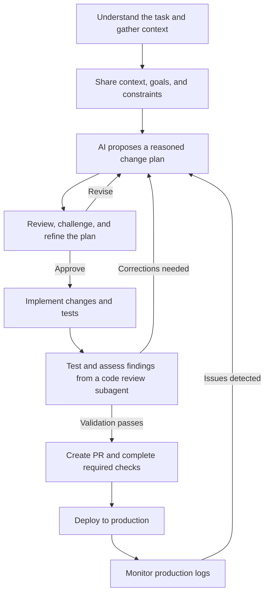

<h1 align="center">Hi, I'm Hugo Riveros 👋</h1>
<h3 align="center">Frontend Software Engineer · React · Next.js · TypeScript</h3>

  Engineering web products with a focus on user experience, performance, and maintainable integrations.

  <a href="https://hugoriverosdev.vercel.app">Portfolio</a> ·
  <a href="https://www.linkedin.com/in/hugo-felipe-riveros-fajardo">LinkedIn</a> ·
  <a href="mailto:hugoriverosfajardo@gmail.com">Email</a>

Bogotá, Colombia · Open to frontend engineering opportunities

## About me

I build web applications, reusable interfaces, and integrations between systems. My experience spans e-commerce and payment technology, from complete storefronts to SDKs and checkout flows.

I moved into software development through self-directed learning and continued training. I enjoy turning complex systems into clear diagrams, useful tools, and maintainable code, and applying that experience to different kinds of web products.

## Selected experience

### Yuno · Frontend Software Engineer

February 2026 – October 2026

- Developed and maintained SDKs, checkout experiences, and payment integrations with Product, Design, and Backend teams.
- Implemented advanced capabilities in the Yuno plugin for VTEX: payments for orders with multiple sellers, recurring payments, and additional charges when order totals change.
- Built an Apple Pay and Google Pay experience that removes an intermediate checkout screen and opens the native wallet flow directly.
- Improved error handling and response deadlines in the VTEX payment connector to mitigate failures that contribute to Contingency Mode activation.
- Developed, maintained, and published the Yuno plugin for WordPress to process payments in WooCommerce, addressing official WordPress Plugin Directory review feedback.
- Created Yunex, an assistant specialized in the Yuno–VTEX integration, with skills for incident investigation using Datadog logs. Automated its knowledge updates through Claude routines, with daily Slack notifications.
- Contributed to public plugin documentation and internal tools for payment-flow visualization and knowledge sharing.

Public documentation of features I worked on:
[Apple Pay & Google Pay experience](https://docs.y.uno/docs/plugins/vtex/apple-pay-google-pay-enhanced-experience) ·
[Advanced VTEX payment features](https://docs.y.uno/docs/plugins/vtex/advanced-features)

### ITGlobers · Frontend Developer → Mid-level Frontend Developer

October 2022 – February 2026  
Promoted to Mid-level Frontend Developer in April 2025.

- Built VTEX storefronts and custom applications for clients across Latin America, Europe, and Asia, covering product discovery, checkout, order confirmation, and login.
- Developed reusable components and integrations with React, TypeScript, VTEX IO, and GraphQL.
- Optimized resource loading, interface responsiveness, and layout stability, and contributed to development estimation and planning.

## Technologies I work with

| Area | Technologies and tools |
| --- | --- |
| Frontend | React, Next.js, TypeScript, JavaScript, HTML, CSS, Tailwind CSS, Sass |
| Platforms and integrations | VTEX IO, FastStore, GraphQL, SDKs, checkout and payment connectors, WordPress / WooCommerce |
| Quality and observability | Vitest, Playwright, Jest, Datadog |
| Collaboration | Git, GitHub, Figma, Jira |
| AI-assisted engineering | Claude Code, reusable skills, workflows with agent teams |

## How I work

I combine engineering judgment with AI-assisted development. At Yuno, I used Claude Code daily to investigate problems, plan changes, implement solutions, and support code review. I built reusable skills for recurring tasks, and I'm also exploring Codex.

My workflow starts with understanding the task myself. I give the AI the intended outcome and relevant constraints, ask it to propose a reasoned approach, and review that plan before implementation.

Explore my AI-assisted engineering workflow

1. Understand the task and gather context. I review the problem, intended outcome, acceptance criteria, dependencies, and constraints myself. This helps me identify inconsistencies and supply context that the AI may not infer from the code or available documentation.

2. Share the relevant context. I provide Jira tasks, relevant Slack discussions, public or internal documentation, the repositories involved, and additional knowledge about the system. I make the intended outcome clear while leaving room for the AI to propose implementation approaches.

3. Request a reasoned change plan. I ask the AI to explain its proposed decisions and tradeoffs, identify assumptions or missing information, and account for compatibility and validation. I generally describe what needs to be achieved rather than prescribe how to implement it, unless a known constraint requires a particular approach.

4. Review and approve the plan. I question decisions, check the reasoning against my understanding of the system, and refine the approach when needed. Once I approve the plan, the AI proceeds with implementation and the corresponding tests.

5. Validate and seek a second review perspective. I run the appropriate tests and environment checks, and use a dedicated code review subagent with a separate context to identify change-related risks, potential security issues, and edge cases. I assess its findings myself. When corrections are needed, I return to planning, review the proposed fix, and repeat implementation and validation.

6. Move through PR and release. Once validation passes, I create the pull request, complete the required reviews and checks, and proceed through the deployment process.

7. Monitor production behavior. After deployment, I review production logs to check that the changes behave as expected and identify errors, unexpected behavior, or integration issues. If monitoring reveals a problem, I investigate it and return to the planning and validation cycle to address it.

## Languages

Spanish — Native · English — C1
