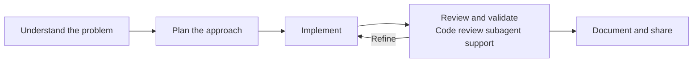

<h1 align="center">Hi, I'm Hugo Riveros 👋</h1>
<h3 align="center">Frontend Software Engineer · React · Next.js · TypeScript</h3>

  Engineering web products with a focus on user experience, performance, and maintainable integrations.

  <a href="https://hugoriverosdev.vercel.app">Portfolio</a> ·
  <a href="https://www.linkedin.com/in/hugo-felipe-riveros-fajardo">LinkedIn</a> ·
  <a href="mailto:hugoriverosfajardo@gmail.com">Email</a>

Bogotá, Colombia · Open to frontend engineering opportunities

## About me

I build web applications, reusable interfaces, and integrations between systems. My experience spans e-commerce and payment technology, from complete storefronts to SDKs and checkout flows.

I moved into software development through self-directed learning and continued training. I enjoy turning complex systems into clear diagrams, useful tools, and maintainable code, and applying that experience to different kinds of web products.

## Selected experience

### Yuno · Frontend Software Engineer

February 2026 – October 2026

- Developed and maintained SDKs, checkout experiences, and payment integrations with Product, Design, and Backend teams.
- Implemented advanced capabilities in the Yuno plugin for VTEX: payments for orders with multiple sellers, recurring payments, and additional charges when order totals change.
- Built an Apple Pay and Google Pay experience that removes an intermediate checkout screen and opens the native wallet flow directly.
- Improved error handling and response deadlines in the VTEX payment connector to mitigate failures that contribute to Contingency Mode activation.
- Developed, maintained, and published the Yuno plugin for WordPress to process payments in WooCommerce, addressing official WordPress Plugin Directory review feedback.
- Created Yunex, an assistant specialized in the Yuno–VTEX integration, with skills for incident investigation using Datadog logs. Automated its knowledge updates through Claude routines, with daily Slack notifications.
- Contributed to public plugin documentation and internal tools for payment-flow visualization and knowledge sharing.

Public documentation of features I worked on:
[Apple Pay & Google Pay experience](https://docs.y.uno/docs/plugins/vtex/apple-pay-google-pay-enhanced-experience) ·
[Advanced VTEX payment features](https://docs.y.uno/docs/plugins/vtex/advanced-features)

### ITGlobers · Frontend Developer → Mid-level Frontend Developer

October 2022 – February 2026  
Promoted to Mid-level Frontend Developer in April 2025.

- Built VTEX storefronts and custom applications for clients across Latin America, Europe, and Asia, covering product discovery, checkout, order confirmation, and login.
- Developed reusable components and integrations with React, TypeScript, VTEX IO, and GraphQL.
- Optimized resource loading, interface responsiveness, and layout stability, and contributed to development estimation and planning.

## Technologies I work with

| Area | Technologies and tools |
| --- | --- |
| Frontend | React, Next.js, TypeScript, JavaScript, HTML, CSS, Tailwind CSS, Sass |
| Platforms and integrations | VTEX IO, FastStore, GraphQL, SDKs, checkout and payment connectors, WordPress / WooCommerce |
| Quality and observability | Vitest, Playwright, Jest, Datadog |
| Collaboration | Git, GitHub, Figma, Jira |
| AI-assisted engineering | Claude Code, reusable skills, workflows with agent teams |

## How I work

I use AI-assisted workflows for research, planning, implementation, and documentation. At Yuno, I worked with Claude Code daily and built reusable skills to streamline recurring tasks. I'm also exploring Codex.

I keep technical decisions, code review, and validation in the loop, and check changes before production.

Explore my engineering workflow

- Understand the context, existing behavior, and integration boundaries.
- Plan changes with maintainability and backward compatibility in mind.
- Use agents and skills for focused research and implementation tasks.
- Use a dedicated code review subagent to surface change-related risks, potential security issues, and edge cases.
- Assess the subagent's findings, review the code, and validate behavior with appropriate tests and environment checks.
- Document decisions and feed useful context back into the team's knowledge.

## Languages

Spanish — Native · English — C1
